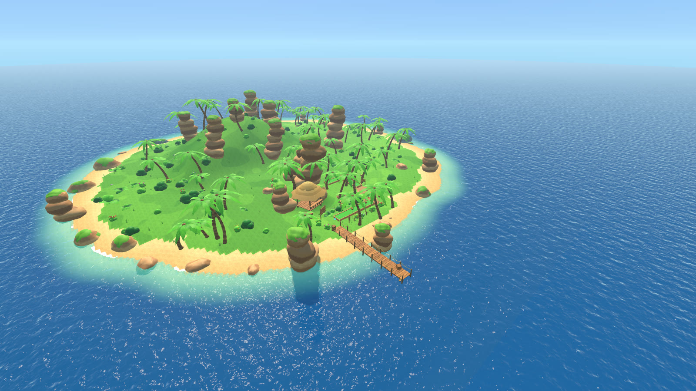
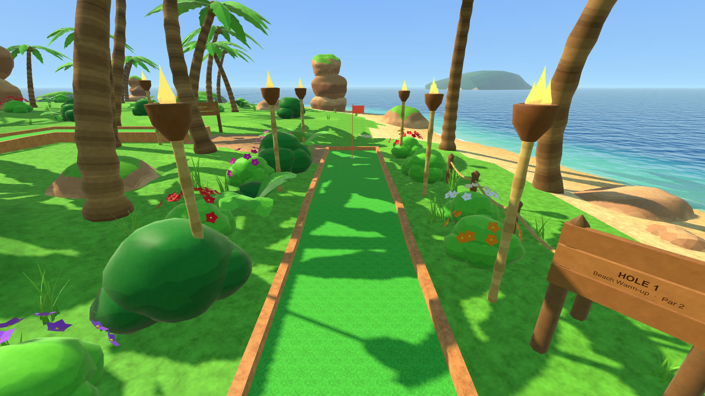
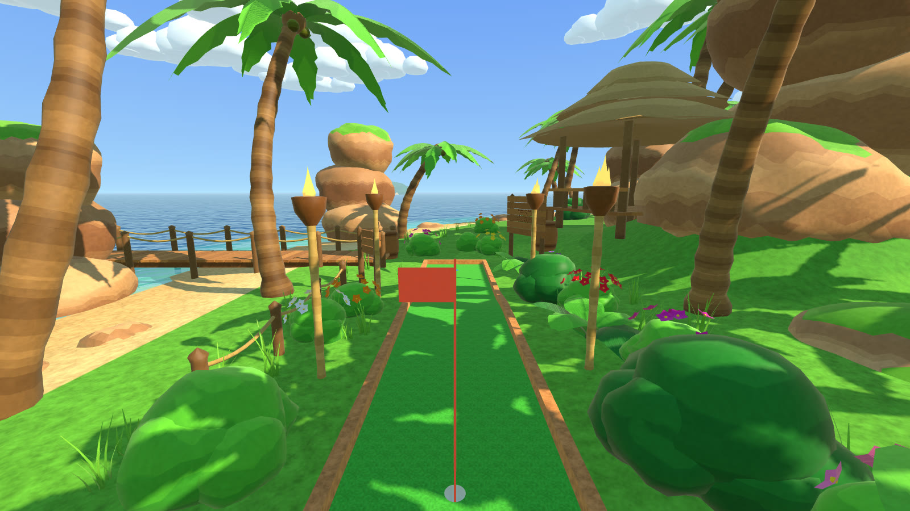
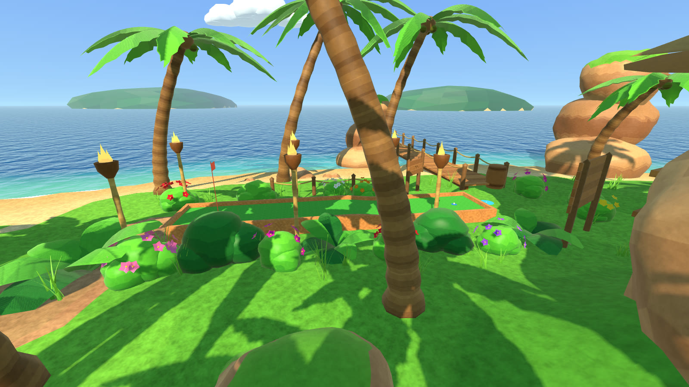
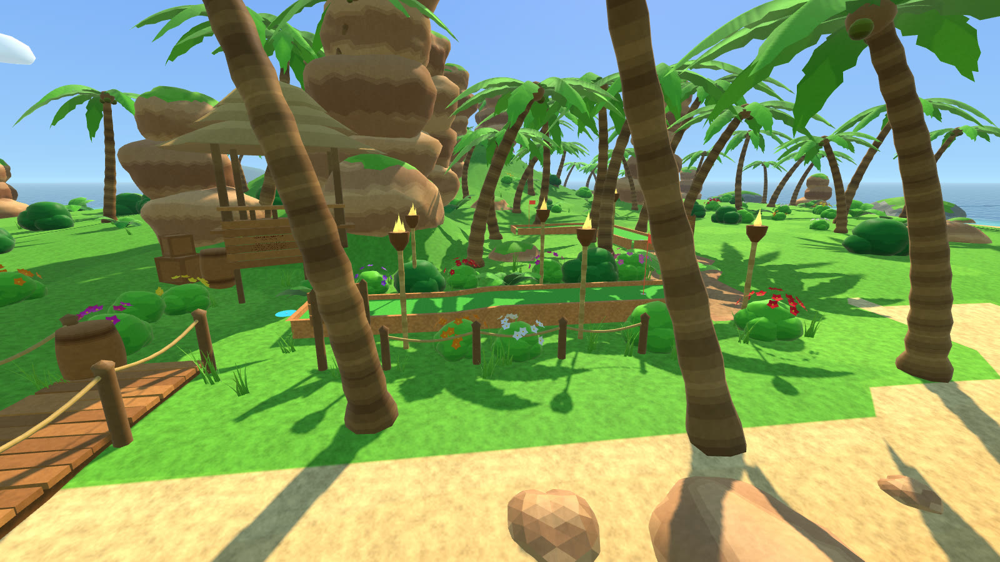
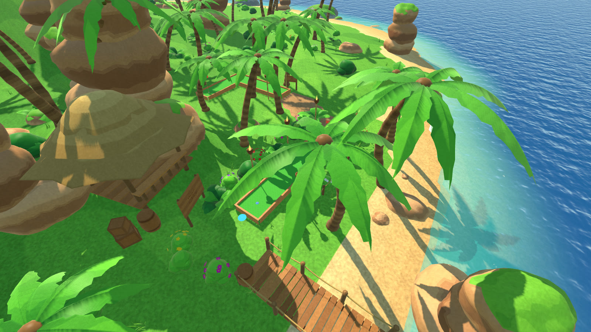
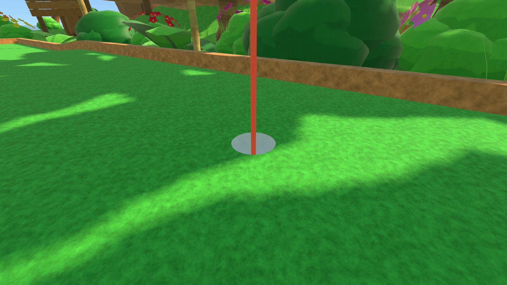
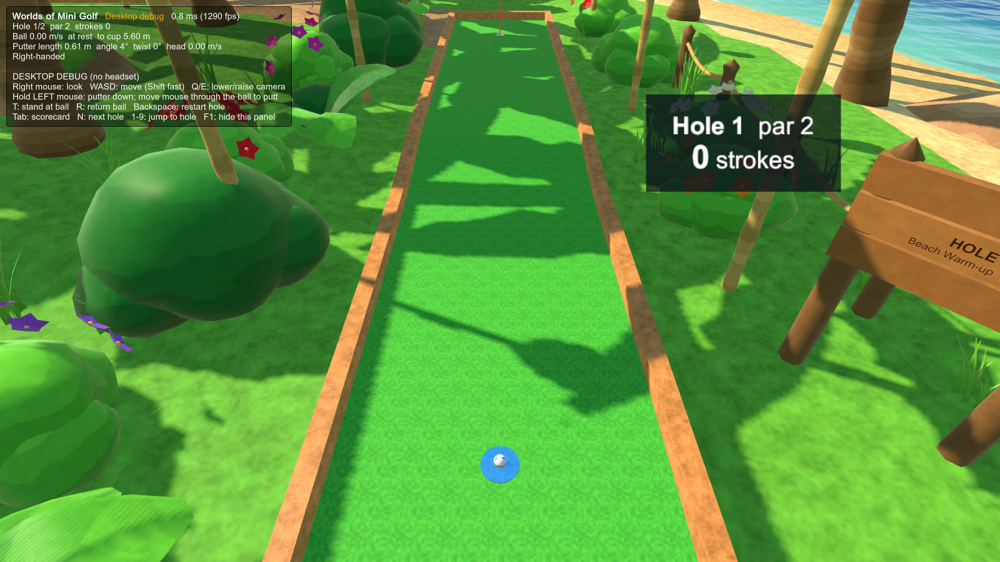

# Checkpoint: Hole 1 visual showcase (Tropical Adventure)

**Status:** ready for visual review by Andrew and ChatGPT HQ. Holes 2–9 will not be built in this style until it is approved.
All images are desktop renders of the generated scene (1600×900). Nothing on this page was checked in the headset.

| | |
|---|---|
|  |  |
| Island overview: lagoon, beaches, central jungle mountain, coastal sandstone crags, pier | Player's view from the Hole 1 tee: lagoon on the right, jungle and sandstone on the left |
|  |  |
| Looking back from the cup toward the clubhouse and pier | From the jungle side, with distant islands on the horizon |
|  |  |
| From the beach: tiki clubhouse, crates, flowering rails | Aerial: Hole 1 along the beach, Hole 2 (draft) beyond |
|  |  |
| Cup and turf close-up | Built game (desktop debug mode) standing at the ball |

## What changed

- **A reusable art kit generated in code.** 52 meshes: 4 palms (banded segmented trunks, serrated swaying fronds, coconuts), 4 bushes (bright and deep-jungle), 3 big-leaf plants, 3 grass tufts, 7 flowering shrubs, 6 rocks, 3 layered sandstone cliff stacks, a tiki hut, pier/boardwalk sections, tiki torches with flames, crates, a barrel, signboards, rope fences, clouds and distant islands. Every mesh is original, deterministic (seeded) and reusable for Holes 2–9.
- **One palette texture** (128×256 px) colours everything, so almost the whole world shares a single material. 13 materials in the scene in total.
- **Custom shaders:** `Gamebreak/StylizedLit` (palette colours, world-space surface grain, sky-tinted ambient light, rim light, wind sway, two-sided leaves), `Gamebreak/StylizedWater` (shallow turquoise to deep blue, shoreline foam, waves, sun glints) and `Gamebreak/GradientSky`. All three are written for single-pass-instanced VR.
- **Generated island:** about 70 m across with a noisy coastline, beaches running into a lagoon, rolling lawns and a central jungle mountain. Hole sites are automatically levelled to the green's height, and a dirt path links each cup to the next tee.
- **Hole 1 "Beach Warm-up"** now runs along the south beach. The lane, rise, cup and par 2 are unchanged; only its position and direction moved. The start sits beside a tiki clubhouse with a welcome/controls board and a hole sign. Torches line the lane, flower beds edge the inland rail, and a pier runs out into the lagoon (it extends automatically until it reaches water). Sandstone crags form the backdrop.
- **Lighting:** a warm low sun with crisp shadows, sky/ground-tinted ambient light and light haze. No post-processing, to protect VR frame time; the saturated palette carries the colour grade instead.
- **Out-of-bounds scenery:** terrain, sand, seabed and rocks now count as out of bounds as soon as the ball touches them, like leaving the carpet in real mini golf. Players can still walk and teleport on them.
- **Course protection:** the world builder scans every green and removes any scenery collider sitting on it, and a regression test checks the built scene the same way. It already caught two misplaced cliffs during this pass.

## Testing and build status

| Check | Result |
|---|---|
| PlayMode tests | **41/41 pass** (adds: no scenery on any green) |
| PCVR build | Succeeds, 118 MB, 0 errors, 0 warnings |
| Desktop debug build | Succeeds, 115 MB |
| Built-game smoke test | PASS: scripted putter swing, hole in one on the new Hole 1, advances to Hole 2 |
| Scene budget | 566 mesh renderers (532 static-batched), 58 unique meshes, 13 materials, 371k vertices / 585k triangles for the whole island (only part of it is ever in view) |

**Not verified (needs the one consolidated VR playtest):** that the custom shaders render correctly in both eyes on the Steam Frame, and VR frame time with the new world. The previous greybox ran at a locked 120 Hz with GPU headroom. The art budget above is moderate, and the session log will report actual GPU time.

## Art-direction decisions for approval

1. **Look:** stylised, saturated, chunky "low-poly plus" (smooth rounded rocks and bushes, flat-colour palette with fine grain), rather than texture-heavy. Is this the right direction for the Crash-inspired brief, or should we push toward more surface detail?
2. **Asset pipeline:** all assets are generated in code inside the repo, with no third-party or AI assets yet, so there are no licence questions. Universal Modder's AI generation needs a `FAL_KEY` that isn't configured. Blender 5.2 is available for later hand-modelled hero pieces such as temple ruins, a waterfall and a broken bridge.
3. **World layout:** one island with nine holes looping around it and a central mountain (a natural site for Volcano Ridge / Paradise Summit). Hole 1 was turned to run along the beach for the ocean views.
4. **Rails:** currently plain orange-brown wood. Alternatives: bamboo rails, stone borders, or a different style per hole (bamboo on the beach, stone at the temple).
5. **Density:** a deliberately clear sightline down each lane, with palms set back. Tell us if you'd like it lusher.

## Known issues / next polish (after approval)

- The terrain colour edge between sand and grass is slightly stair-stepped when seen from high above.
- Ocean glints are a little noisy from far away (fine at player height).
- Flames are stylised static shapes; they could flicker.
- The lawn could use more texture variation and small rocks in places.
- Hole 2 has only basic dressing. It will be finished with Holes 3–9 after approval.
