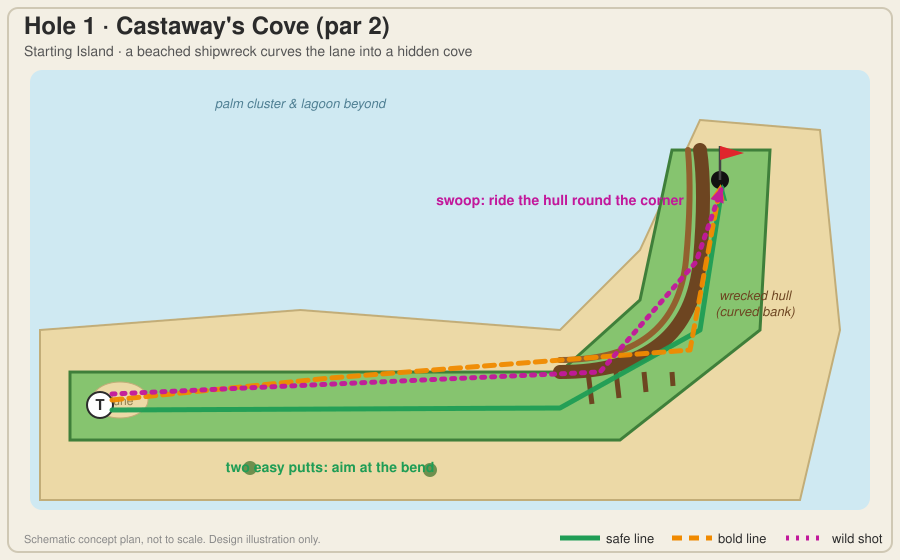
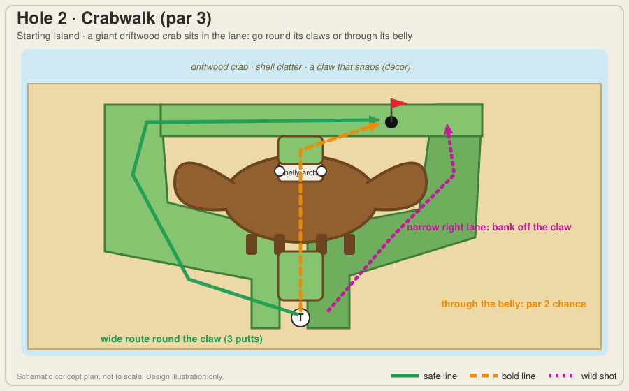
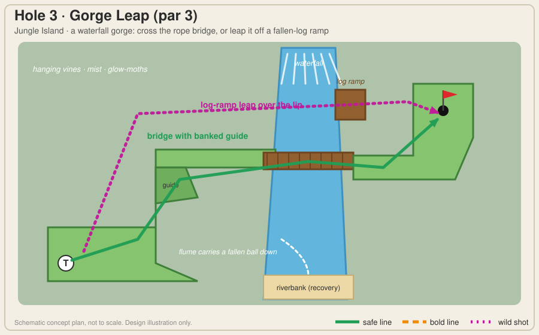
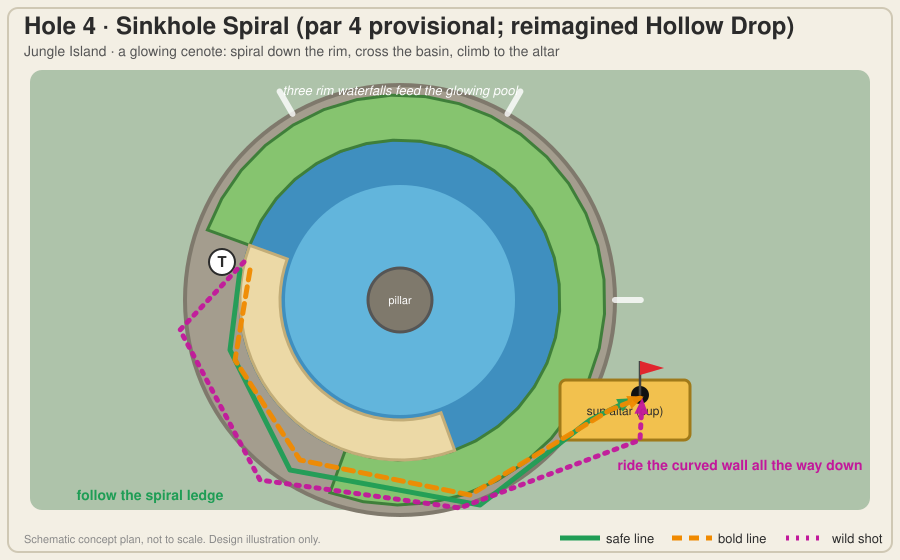
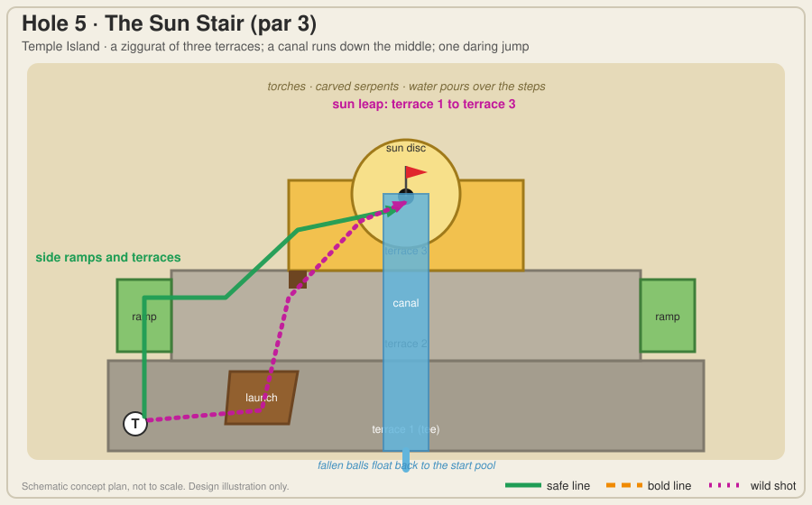
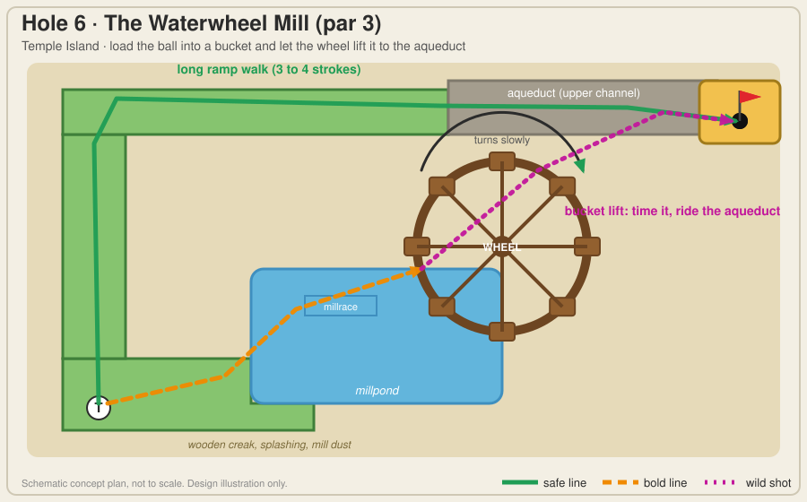
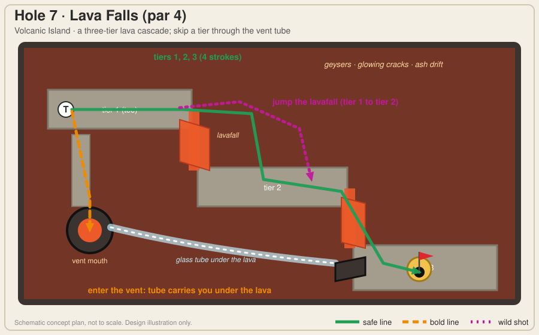
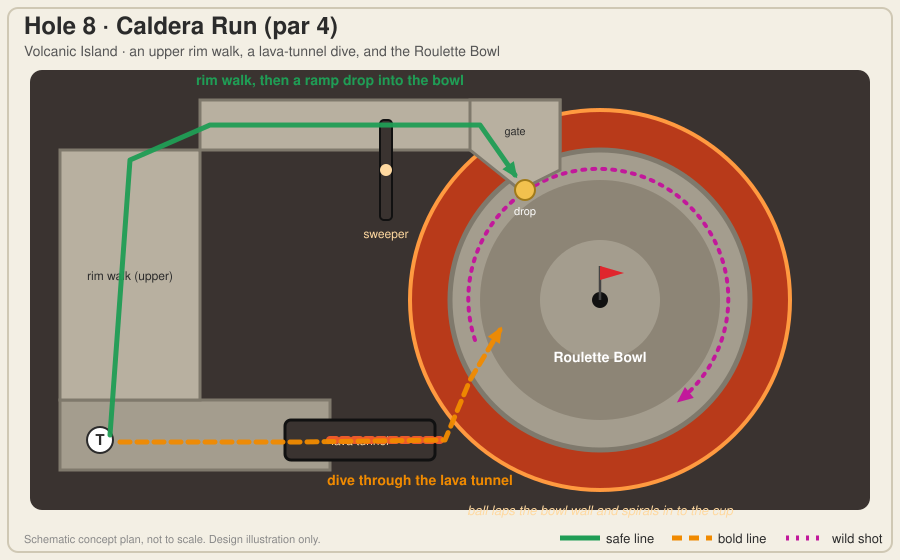
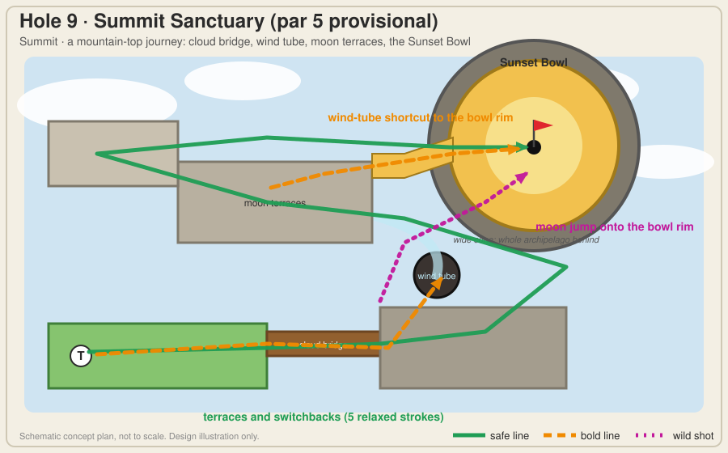

# Worlds of Mini Golf: Tropical Adventure, Creative Concept Pass 2

Status: **CONCEPTS ONLY. Nothing is approved for construction.** No code, scene, geometry, physics, terrain, shader, material or asset was changed. This is the second creative pass requested by HQ; it replaces the *hole concepts* in `HOLE_DESIGN_SPRINT_001.md` (§4 there) and keeps that document's physics research (§3 assessment of the built holes and §5 engine investigation) as the engineering reference.

HQ's note on pass 1, taken to heart: *a ramp, gate, bridge or pipe is a component, not a hole.* Each hole below starts from a **place** and a **spectacle**, then gives the player a choice of shots, then names the **memorable shot** they will want to try again. The engineering is listed separately (§5) and was not allowed to limit the ideas.

All plans are schematic illustrations (`Docs/concepts/holeN.svg`, generated by `Tools/ConceptArt/make_concepts.py`). They show intent, not scale or final geometry.

---

## 1. The course as one journey

Nine holes, five zones, one emotional arc. Each hole has a **centerpiece** (what you remember seeing), a **putting challenge** (what you remember doing) and a **signature shot** (what you try again).

| # | Hole | Zone | Centerpiece | Putting challenge | Signature shot | Feeling |
|---|------|------|-------------|-------------------|----------------|---------|
| 1 | Castaway's Cove | Start | Beached shipwreck hull | A curved wall swings the lane into a hidden cove | **The Swoop** | Charm |
| 2 | Crabwalk | Start | Giant driftwood crab | Round the claws, or through its belly | **Belly Roll** | Delight |
| 3 | Gorge Leap | Jungle | Waterfall gorge and rope bridge | Cross the bridge, or leap the gap | **Gorge Leap** | Drama |
| 4 | Sinkhole Spiral | Jungle | Glowing cenote with rim waterfalls | Spiral down, cross the basin, climb to the altar | **Wall of Death** | Awe |
| 5 | The Sun Stair | Temple | Ziggurat with water cascading down it | Three terraces, one daring jump | **Sun Leap** | Grandeur |
| 6 | The Waterwheel Mill | Temple | Giant working waterwheel | Load a bucket and ride the aqueduct | **Bucket Brigade** | Wonder |
| 7 | Lava Falls | Volcanic | Three-tier lava cascade | Step down the tiers, or take the vent tube | **Vent Cannon** | Thrill |
| 8 | Caldera Run | Volcanic | Crater with a round, banked bowl | Reach the bowl; let it spin the ball in | **Roulette** | Mastery |
| 9 | Summit Sanctuary | Summit | Mountain-top sanctuary above the clouds | A five-shot journey ending in the Sunset Bowl | **Moon Jump** | Triumph |

**Mechanics recur, appearances change** ("build once, reinvent seven times"):

| Mechanic | Where it appears, simplest first |
|----------|----------------------------------|
| Curved bank | 1 hull, 2 claw, 3 guide, 4 spiral wall, 8 bowl, 9 bowl |
| Tunnel or tube | 2 belly arch, 7 vent tube, 8 lava tunnel, 9 wind tube |
| Jump | 3 log ramp, 5 launch, 7 lavafall hop, 9 moon jump |
| Flowing water (carries the ball) | 3 flume, 5 canal, 6 millrace |
| Multi-level | 4 spiral, 5 terraces, 7 tiers, 8 rim over bowl, 9 terraces |
| Moving or carrying machine | 6 wheel, 8 sweeper |
| Hazard with a price | 3 gorge, 7 lava, 8 lava |

**Difficulty is a wave, not a ramp:** 1 charming and easy, 2 easy, 3 medium and forgiving, 4 medium (pace), 5 relaxed showpiece, 6 medium (timing), 7 spike, 8 demanding, 9 long and celebratory. Early holes keep a safe, readable, two-putt line; ambition lives in the optional shots.

---

## 2. Early holes: accessible, but already surprising

### Hole 1, Castaway's Cove (par 2)



**Place and spectacle.** A sandy beach lane runs up to a half-buried **shipwreck**. The curved hull is the outside wall of a bend that opens into a small hidden cove where the cup sits. Gulls, a washed-up lantern, a message-in-a-bottle prop.

**Putting challenge.** A gentle dune crest mid-lane teaches pace. At the bend the lane turns, and the hull is a *curved* wall rather than a square corner.

**Shot menu.**
- **Safe:** two putts, aiming at the bend and then the cup. Par 2 for most players.
- **Bold:** a firm shot along the outside of the lane that kisses the hull and rolls on.
- **Wild (signature, "The Swoop"):** hit hard along the north rail; the curved hull catches the ball and *sweeps* it round the corner and into the cove. A hole-in-one chance that feels like surfing a wave.

**Recovery.** Overhit rebounds off the hull; underhit rests on the lane; nothing is out of bounds.
**Why replay it:** the Swoop is satisfying and visibly "cheating the corner" without being required.
**Engineering:** curved bank wall (E1). *Fallback:* a plain bend with the hull as decoration still plays as a gentle first hole.

### Hole 2, Crabwalk (par 3)



**Place and spectacle.** A **giant crab built of driftwood and shells** straddles the lane. Its claws form the split; its legs are the pillars of an arch. A claw snaps now and then (decorative) and the eyes watch the ball.

**Putting challenge.** The first real route choice. The **wide left lane** curls round a claw (long, forgiving). The **belly arch** is a short tunnel between the crab's legs. The **narrow right lane** hugs the other claw.

**Shot menu.**
- **Safe:** wide left lane, three comfortable putts.
- **Bold:** straight through the belly arch for a real par-2 chance; the ball disappears under the crab and pops out at the far side with the cup in view.
- **Wild:** the narrow right lane with a bank off the claw into the cup shelf.

**Balance rule.** A miss at the arch rebounds to the fork (about one stroke); the right lane's claw is angled so a bank misses toward the wide route, so no unintended bank dominates (the first pass found a bank dominated both routes).
**Why replay it:** the Belly Roll, because the ball vanishes and reappears.
**Engineering:** tunnel roof (E2, buildable now), curved bank (E1), split junction (buildable now).

### Hole 3, Gorge Leap (par 3)



**Place and spectacle.** A **waterfall plunges into a jungle gorge** with a rope bridge over it, mist, vines and glow-moths. A fallen log leans against the cliff near the waterfall.

**Putting challenge.** Get across a ravine that is the real hazard. A banked **guide wall** funnels a loosely aimed ball toward the bridge; the bridge has a **peaked** crest. The first pass found the as-built crossing window too narrow for par.

**Shot menu.**
- **Safe:** along the guide wall, over the bridge, two more putts. Par 3.
- **Wild (signature, "The Gorge Leap"):** drive up the **fallen log**, which is a ramp, and fly the narrow gap by the waterfall onto the far lawn. A hit that clears it is a hole-in-one candidate.
- **Recovery as spectacle:** a ball that falls lands in the gorge river; a **log flume** (a water channel that carries the ball) floats it to a riverbank strip. It costs one stroke but the ball *rides the river*.

**Why replay it:** the leap is a real "did I just do that?" moment, and falling is entertaining instead of just punishing.
**Engineering:** open edges and landing rules (E3), flow zone (E5), bank guide (E1). Bridge, funnel and recovery strip need nothing new.

### Hole 4, Sinkhole Spiral (par 4 provisional; replaces the three-turn S of Hollow Drop)



**Why change it.** Headset feedback: Hollow Drop is "too long, too many turns". The sim agrees: five straight legs. The *drop and the climb* are good and are kept.

**Place and spectacle.** A **cenote**: a round sinkhole in the jungle with glowing blue water, a central stone pillar, and three waterfalls pouring over the rim. The lane is a **single curving ledge** that spirals down the inside wall (about three-quarters of a turn) to a sandy basin, then climbs a short ramp to a golden **sun altar** where the cup sits.

**Putting challenge.** One continuous curve replaces three turns. The ledge's outer wall is curved and banked, so the player is steering a *curve*, not hitting three separate legs.

```
 side view (the drop, the basin, the climb)
   T ____
         \___  spiral ledge drops 24 cm
             \______ basin ______/-- altar (cup, 10 cm up)
```

**Shot menu.**
- **Safe:** three or four putts following the ledge; a soft first shot rolls to the spiral's first bend.
- **Bold:** a firm shot that hugs the outer wall and follows it round.
- **Wild (signature, "Wall of Death"):** one perfectly paced shot rides the curved outer wall the whole way down, across the basin and up the climb. A hole-in-one that looks spectacular.

**Recovery:** the ledge's inner edge is a low lip so the ball cannot fall into the pool; a timid climb rolls back to the basin with no penalty.
**Why replay it:** the Wall of Death, and the view of waterfalls from the ledge.
**Engineering:** curved ledge with a curved rail and a sloped surface (E1, E4). *Fallback:* the original S with elbow kickers.

---

## 3. The ambitious holes

### Hole 5, The Sun Stair (Temple Island, par 3)



**Place and spectacle.** A stepped **ziggurat** of three terraces, with torches, carved serpents and a golden **sun disc** at the summit where the cup is. A **canal** pours down the centre of the stair, splashing over each step.

**Putting challenge.** Real elevation: three levels. Side ramps lead up each terrace; the canal is a river down the middle.

```
 side view
                          ___________ sun disc / cup
                 ______  /
      T _______/ launch \/  <- gap over the canal
   (terrace 1)  (terrace 2)   (terrace 3)
```

**Shot menu.**
- **Safe:** side ramps and terraces: three relaxed putts.
- **Bold:** ride the canal's edge up the middle ramp.
- **Wild (signature, "Sun Leap"):** a launch ramp on terrace 1 flies the canal and lands on terrace 3 beside the sun disc. A hole-in-one chance from the tee.

**Recovery as spectacle:** a ball that falls in the canal is carried by the current to the start pool (one stroke), so the stairs never trap anyone.
**Why replay it:** the Sun Leap, and the cascade of water.
**Engineering:** multi-level or terraced green (E4), launch ramp (E3), flow zone (E5).

### Hole 6, The Waterwheel Mill (Temple Island, par 3)



**Place and spectacle.** A **huge working waterwheel** turning slowly beside a millpond, with creaking wood, splashing water and drifting dust. An **aqueduct** channel runs from the wheel's top across to the cup platform.

**Putting challenge.** A *machine you can use*. The cup is up high. The long way is a ramp walk round the mill. The clever way is to roll the ball down the **millrace** into a passing **bucket**; the wheel lifts it and tips it into the aqueduct, which rolls it to the cup.

```
 side view of the wheel
              aqueduct ____________ cup
        ___  /
   bucket  (  ) wheel lifts the ball
   millrace\_/ pond
```

**Shot menu.**
- **Safe:** the ramp walk (three to four strokes), no timing.
- **Bold:** a putt down the millrace into a bucket, timed to the wheel.
- **Wild (signature, "Bucket Brigade"):** time a hard putt straight onto an ascending bucket for a one-stroke ride to the aqueduct.

**Recovery:** a miss drops in the millpond shallows and floats to the bank (one stroke); the wheel keeps turning.
**Why replay it:** it feels like beating a machine.
**Engineering:** ball carrier (E6, capture the ball, move it with the bucket, release it), flow zone (E5), animated wheel (E9).

### Hole 7, Lava Falls (Volcanic Island, par 4)



**Place and spectacle.** A **three-tier lava cascade** pouring down stepped basalt platforms, with geysers, glowing cracks and ash. An obsidian **vent mouth** beside the tee leads to a glass tube that runs *under the lava*.

**Putting challenge.** A descending hole: tier 1 (tee), tier 2, tier 3 (cup). Lavafalls separate the tiers and lava is a hazard (one stroke, back to your last spot). The safe line steps down tier by tier.

**Shot menu.**
- **Safe:** tier 1 to tier 2 to tier 3, four strokes, each shot well away from lava.
- **Bold:** drop the ball in the **vent tube**; it flies through the glass tube beneath the lava and emerges beside tier 3.
- **Wild (signature, "Vent Cannon"):** hit the vent fast enough and the tube *fires* the ball out in a flat arc across the last lava moat to land on tier 3.

**Recovery:** lava resets the ball to the previous rest spot; a recovery ledge on each tier catches a short shot.
**Why replay it:** the Vent Cannon, and watching the ball glow through the tube.
**Engineering:** teleport transport tube with an exit launcher (E7, E8), hazard volumes (E10), tiered multi-level green (E4), a short jump (E3).

### Hole 8, Caldera Run (Volcanic Island, par 4)



**Place and spectacle.** The inside of a **volcano crater**: a round, banked **Roulette Bowl** ringed by lava with the cup at its centre. An upper **rim walk** circles one side; a **lava tunnel** passes beneath it from the tee; an obsidian **sweeper** rotates over the rim path.

**Putting challenge.** Reaching the bowl is the puzzle; the bowl then does the show.
- **Safe:** the rim walk to a **gate** and a ramp drop into the bowl, timed past the slow sweeper.
- **Bold:** dive through the lava tunnel, which emerges at the bowl's lip.

**The Roulette (signature).** Hit the ball *along the bowl's banked wall* and it laps the crater wall, slowing, and spirals into the cup like a roulette ball. The paper model found a bowl of about 2 m radius with a 10% cone drops the ball in anywhere from about 28% to 78% of the time depending on pace (a gentle first lap is best), and otherwise rests within about 35 cm of the cup. A smaller bowl (1.5 m) always stopped short in a flat centre, so the bowl must be large and the cup must sit at the very bottom.

**Design note.** The bowl is nearly speed-forgiving, which is why it is the *reward*, not the whole hole: all of the difficulty is in reaching and entering it.

**Recovery:** the sweeper bumps the ball but never pins it; the bowl rim keeps the ball in; lava edges are guarded by a low lip except at the hazard.
**Why replay it:** the Roulette is the most visually satisfying ball path in the course.
**Engineering:** curved banked bowl with a cone profile (E1, E4), moving sweeper with velocity transfer (E11), stacked rim over tunnel (E4), hazard volume (E10).

### Hole 9, Summit Sanctuary (Summit, par 5 provisional)



**Place and spectacle.** A mountain-top sanctuary above the clouds, with prayer flags, wind chimes and a view of the whole archipelago. The hole is a **five-shot journey** that ends in the **Sunset Bowl**.

**The journey (not one automatic funnel):**
1. **Start terrace.** An open, gentle shot.
2. **Cloud bridge.** A rope-and-plank bridge across a drop to terrace 2.
3. **Moon terraces.** Stepped terraces with ramps and a short **wind tube**.
4. **Switchbacks** up to the rim of the bowl.
5. **The Sunset Bowl**, a wide golden cone with the cup at its centre and the horizon behind it. Lanterns float up when the ball drops.

**Shot menu.**
- **Safe:** terraces and switchbacks, five relaxed strokes.
- **Bold ("wind tube shortcut"):** shoot the tube from terrace 2 and it delivers the ball to the moon terraces and near the bowl rim.
- **Wild (signature, "Moon Jump"):** a launch ramp from terrace 2 flies the gap and lands on the bowl rim, a one-shot finish chance after a long journey.

**Recovery:** every stage has a gentle catch area; a fallen ball returns to the last terrace.
**Why replay it:** it combines the earlier mechanics into a finale and ends on the course's best view.
**Engineering:** reuses E1, E3, E4, E7 and the bowl from Hole 8; adds a long multi-section hole.

---

## 4. What a good miniature-golf course designer would check

- **Do the first three holes make people smile?** Yes by design: a shipwreck, a crab, a waterfall.
- **Is there an optional trick on every hole?** Yes (the Swoop, Belly Roll, Gorge Leap, Wall of Death, Sun Leap, Bucket Brigade, Vent Cannon, Roulette, Moon Jump).
- **Is failure fun?** Falling in the gorge, canal or pond floats the ball back on a river or flume instead of just resetting.
- **Can a beginner finish every hole?** Every hole has a plain safe route; the clever route is never required.
- **Is any hole just a funnel?** No: the bowls (8 and 9) are payoffs for a challenge, not the challenge.
- **Obstacle carnival risk:** each hole has one headline mechanic. Hole 8 combines two (bowl and sweeper), and Hole 9 recombines earlier ones, so the course does not escalate by piling on gimmicks.

---

## 5. Engineering required (separate from the creative ideas)

Detailed physics analysis is in `HOLE_DESIGN_SPRINT_001.md` §5 and is unchanged. This table adds the items the new concepts introduce. Nothing here is implemented; effort is a rough order of magnitude.

| ID | System | What it is | Needed by | Effort | Risk |
|----|--------|------------|-----------|--------|------|
| E1 | Curved and angled bank walls | A polyline wall extruded into a collider (facets of 5° or less). The ball already reflects off any normal correctly, so no physics change. May sit on a rectangle-union green with hidden filler behind the wall, so freeform green outlines are *not* required to start. | 1, 2, 3, 4, 8, 9 | Medium | Low |
| E2 | Tunnel roofs | A roof collider over a lane with a viewing window; short, with a rule for a ball stopping inside | 2, 8, 9 | Low | Low (no-rest rule) |
| E3 | Launch ramps and open edges | A per-edge rail opt-out at a lip and at a landing edge, landing rules, and a flight test. Jumps are short and low (range about 0.3 to 1.6 m for 15 to 25° at 2.5 to 5 m/s). | 3, 5, 7, 9 | Medium | Medium (landing tuning) |
| E4 | Multi-level and sloped curved surfaces | Terraced and stacked greens, curved ledges, cone bowls. PhysX supports it; the generator needs levels, connectors, clearance and rest rules. | 4, 5, 7, 8, 9 | High | Medium (player visibility under decks) |
| E5 | Flow zones | A trigger volume applying acceleration along a path so water carries the ball: flumes, canals, millrace. Small, no change to `GolfBall` internals if done as an applied force. | 3, 5, 6 | Low | Low |
| E6 | Ball carrier | Capture the ball into a moving bucket (kinematic hold), move it with the wheel, release it. | 6 | Medium | Medium (capture and release timing) |
| E7 | Transport tubes | A teleport-style tube: entry trigger, hold, animate the ball through a see-through tube, release. | 7, 9 | Medium | Low (state handling) |
| E8 | Launchers | A scripted exit velocity at a tube end or vent. | 7 | Low | Low |
| E9 | Animated set-pieces | The waterwheel, snapping claw, geysers, lanterns: decorative, no collisions. | all | Low to medium | Low |
| E10 | Hazard volumes | A trigger that calls the existing out-of-bounds path. | 3, 7, 8 | Low | Low |
| E11 | Moving obstacles with velocity transfer | Kinematic barrier; the rebound uses the *relative* velocity. | 8 (and a slow gate if used) | Medium | Medium |
| E12 | Recovery chutes | A catch area that returns the ball by flow or tube with a stroke penalty. Composed from E5 and E7. | 3, 5, 6 | Low | Low |
| E13 | Freeform green outlines (later, optional) | Polygon greens with curved rails | polish for 1, 4, 8, 9 | High | Medium |

**Suggested order of construction (after approval):**
1. **Proving ground, not a hole:** one greybox test scene to prove the three riskiest ideas on the headset: a launch ramp and landing (E3), a bucket carrier (E6), and a roulette bowl (E1, E4). Learn what *feels* good before building any island.
2. **Cheap and decisive first:** E1 banks, E10 hazards, E5 flow, E2 roofs; then rebuild Holes 1, 2 and 3 (first pass of their new identities).
3. **E3 jumps and E7 tubes**, then Hole 4's spiral and Temple Island (5, 6).
4. **E4 stacked and E11 moving**, then Volcanic Island (7, 8), then the Summit (9).

---

## 6. Honest uncertainty

- Only the roulette bowl was checked on paper (a simple model with assumed player scatter, no airborne flight and no lip-outs). The wheel, jumps, tubes and flow are untested ideas and **need Unity and headset testing**.
- Jump distances are from ballistic formulas, ignoring speed lost on the ramp.
- Some ideas may not feel good; the proving-ground step exists to find that out cheaply.
- The visuals are schematic. Final art is for later, and Graphics Pass 3 has not started.

---

## 7. Decisions for Andrew and HQ

1. **Approve the nine concepts** (or name the ones to rework). The most debatable: Hole 6's ball-lifting wheel and Hole 8's roulette bowl.
2. **Hole 4:** replace the S with the Sinkhole Spiral (recommended), or keep the as-built S with kickers?
3. **Recovery-as-spectacle:** is a ball floating back on a river or flume (one stroke) the right replacement for a plain reset?
4. **Hole 9 length:** confirm a five-shot par-5 summit with the Sunset Bowl as the finale.
5. **Approve a proving-ground greybox scene as the first construction step**, before any island is built.
6. **Order:** confirm banks, hazards, flow and tunnels first, then jumps and tubes, then stacked levels and moving obstacles.
